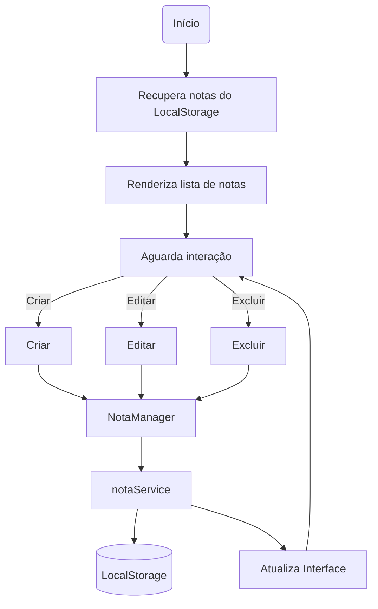

# Quick Notes

## Levantamentos

- O usuário poderá criar várias notas.
- As notas permanecerão salvas mesmo após o fechamento do navegador.
- O usuário poderá editar notas existentes.
- O usuário poderá excluir notas.
- Cada nota possuirá um título, uma descrição e uma categoria.
- O sistema registrará automaticamente a data de criação da nota.
- O usuário não informará a data manualmente.
- O título será limitado a 80 caracteres.
- A descrição será limitada a 1000 caracteres.
- Não haverá pesquisa de notas nesta versão.
- Não haverá filtro por categorias nesta versão.
- As notas serão exibidas da mais recente para a mais antiga.
- O sistema será utilizado em desktop e dispositivos móveis.
- Não será necessário login.

---

# Requisitos

## Funcionais

| Código | Requisito |
|:------:|-----------|
| RF01 | Permitir criar uma nova nota. |
| RF02 | Permitir editar uma nota existente. |
| RF03 | Permitir excluir uma nota. |
| RF04 | Exibir todas as notas cadastradas. |
| RF05 | Exibir título, descrição, categoria e data de criação da nota. |
| RF06 | Persistir as notas utilizando LocalStorage. |
| RF07 | Recuperar automaticamente as notas salvas ao abrir a aplicação. |
| RF08 | Exibir as notas da mais recente para a mais antiga. |

## Não Funcionais

| Código | Requisito |
|:------:|-----------|
| RNF01 | Interface responsiva. |
| RNF02 | Funcionar nos principais navegadores modernos. |
| RNF03 | O título será limitado a 80 caracteres. |
| RNF04 | A descrição será limitada a 1000 caracteres. |
| RNF05 | A persistência será realizada utilizando LocalStorage. |

---

# Responsabilidades

## Main (Interface)

- Capturar eventos da interface.
- Orquestrar o fluxo da aplicação.
- Atualizar a interface.
- Preencher e limpar o formulário.
- Solicitar operações ao Gerenciador de Notas.
- Solicitar persistência ao Serviço de Notas.

## Gerenciador de Notas

- Criar notas.
- Atualizar notas.
- Excluir notas.
- Localizar notas.
- Controlar o estado de edição.

## Serviço de Persistência

- Salvar notas no LocalStorage.
- Recuperar notas do LocalStorage.

---

# Arquitetura

A aplicação foi organizada em camadas de responsabilidade.

O `main.js` é responsável apenas pela interface e pelo fluxo da aplicação.

As regras relacionadas às notas foram concentradas em um Gerenciador de Notas (`notaManager.js`), evitando que a interface conheça detalhes da manipulação dos dados.

A persistência foi isolada em um serviço (`notaService.js`), responsável exclusivamente pela comunicação com o LocalStorage.

Essa organização reduz o acoplamento entre interface, regras de negócio e persistência, facilitando manutenção e evolução da aplicação.

Estrutura atual:

```text
js/
│
├── main.js
│
├── managers/
│   └── notaManager.js
│
└── services/
    └── notaService.js
```

---

# Fluxo

