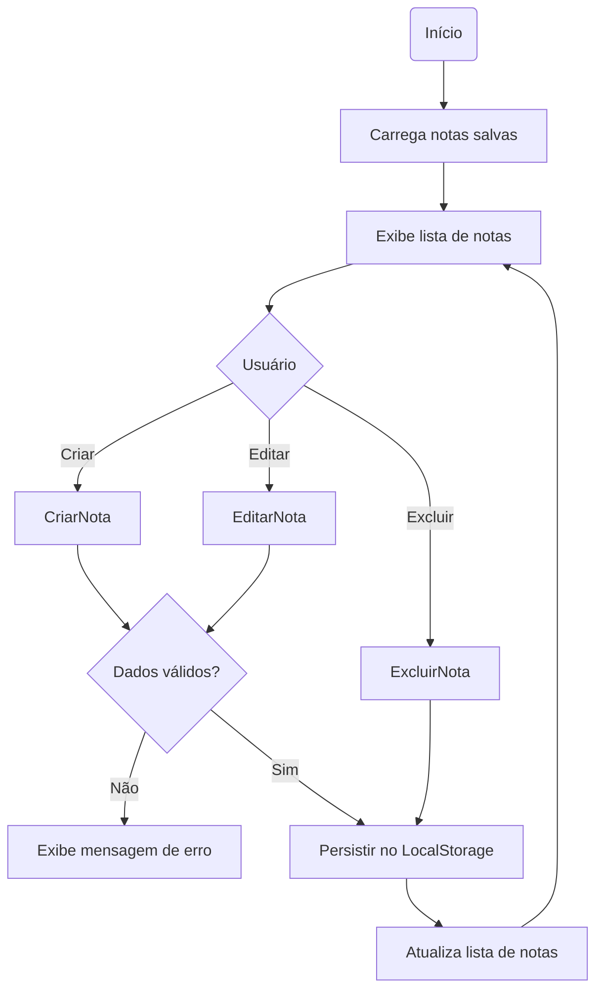

# Quick Notes

## Levantamentos

- O usuário poderá criar várias notas.
- As notas permanecerão salvas mesmo após o fechamento do navegador.
- O usuário poderá editar notas existentes.
- O usuário poderá excluir notas.
- Cada nota possuirá um título, uma descrição e uma categoria.
- O sistema registrará automaticamente a data de criação da nota.
- O usuário não informará a data manualmente.
- O título será limitado a 80 caracteres.
- A descrição será limitada a 1000 caracteres.
- Não haverá pesquisa de notas nesta versão.
- Não haverá filtro por categorias nesta versão.
- As notas serão exibidas da mais recente para a mais antiga.
- O sistema será utilizado em desktop e dispositivos móveis.
- Não será necessário login.

---

## Requisitos

### Funcionais

| Código | Requisito |
|:------:|-----------|
| RF01 | Permitir criar uma nova nota. |
| RF02 | Permitir editar uma nota existente. |
| RF03 | Permitir excluir uma nota. |
| RF04 | Exibir todas as notas cadastradas. |
| RF05 | Exibir título, descrição, categoria e data de criação da nota. |
| RF06 | Persistir as notas utilizando LocalStorage. |
| RF07 | Exibir as notas da mais recente para a mais antiga. |

### Não Funcionais

| Código | Requisito |
|:------:|-----------|
| RNF01 | Interface responsiva. |
| RNF02 | Funcionar nos principais navegadores modernos. |
| RNF03 | O título será limitado a 80 caracteres. |
| RNF04 | A descrição será limitada a 1000 caracteres. |
| RNF05 | A persistência será realizada utilizando LocalStorage. |

---

## Responsabilidades

### Tela

- Exibir notas.
- Receber as ações do usuário.
- Acionar o gerenciamento das notas.
- Exibir mensagens de sucesso ou erro.

### Gerenciador de Notas

- Criar nota.
- Editar nota.
- Excluir nota.
- Validar os dados da nota.

### Memória

- Persistir notas.
- Recuperar notas salvas.

---

## Arquitetura

A aplicação será organizada em responsabilidades.

A tela (`main.js`) será responsável apenas por controlar o fluxo da aplicação e atualizar a interface.

A persistência das notas ficará isolada em um serviço (`notaService.js`), responsável pela comunicação com o LocalStorage.

As validações ficarão concentradas em funções utilitárias (`utils`), permitindo reutilização e manutenção simplificada.

Embora exista conceitualmente um "Gerenciador de Notas", nesta primeira versão optou-se por deixar essa responsabilidade concentrada no `main.js`, mantendo a arquitetura simples e compatível com o porte do projeto. Caso a aplicação cresça, essa responsabilidade poderá ser extraída para uma camada própria.

Estrutura prevista:

```text
js/
│
├── main.js
│
├── services/
│   └── notaService.js
│
└── utils/
    └── validarNota.js
```

---

## Fluxo

