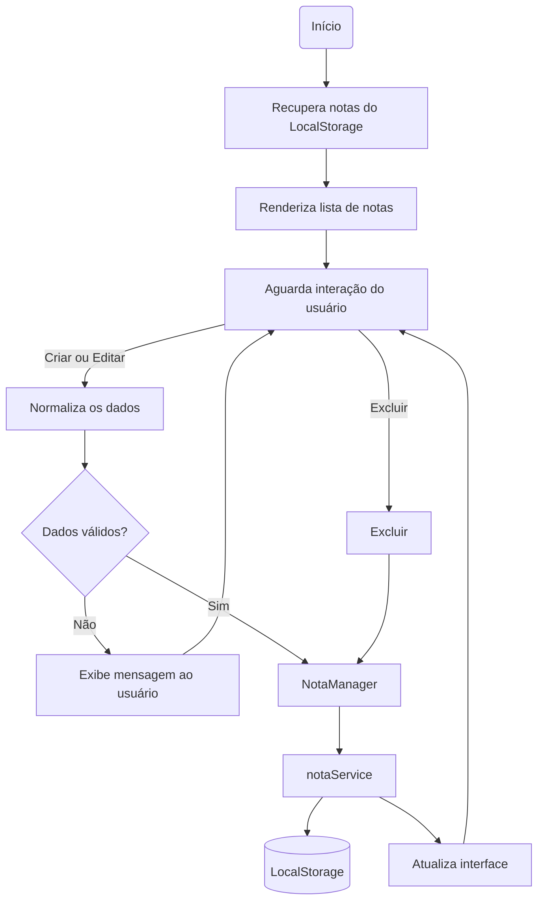

# Quick Notes

## Levantamento

- O usuário poderá criar várias notas.
- As notas permanecerão salvas mesmo após o fechamento do navegador.
- O usuário poderá editar notas existentes.
- O usuário poderá excluir notas.
- Cada nota possuirá um título, uma descrição e uma categoria.
- O sistema registrará automaticamente a data de criação da nota.
- O usuário não informará a data manualmente.
- O título será limitado a 80 caracteres.
- A descrição será limitada a 1000 caracteres.
- Não haverá pesquisa de notas nesta versão.
- Não haverá filtro por categorias nesta versão.
- As notas serão exibidas da mais recente para a mais antiga.
- O sistema será utilizado em desktop e dispositivos móveis.
- Não será necessário login.

---

# Requisitos

## Funcionais

| Código | Requisito |
|:------:|-----------|
| RF01 | Permitir criar uma nova nota. |
| RF02 | Permitir editar uma nota existente. |
| RF03 | Permitir excluir uma nota. |
| RF04 | Exibir todas as notas cadastradas. |
| RF05 | Exibir título, descrição, categoria e data de criação da nota. |
| RF06 | Persistir as notas utilizando LocalStorage. |
| RF07 | Recuperar automaticamente as notas salvas ao abrir a aplicação. |
| RF08 | Exibir as notas da mais recente para a mais antiga. |

## Não Funcionais

| Código | Requisito |
|:------:|-----------|
| RNF01 | Interface responsiva. |
| RNF02 | Funcionar nos principais navegadores modernos. |
| RNF03 | O título será limitado a 80 caracteres. |
| RNF04 | A descrição será limitada a 1000 caracteres. |
| RNF05 | A persistência será realizada utilizando LocalStorage. |

---

# Responsabilidades

## Main (Interface)

Responsável por controlar o fluxo da aplicação.

- Capturar eventos do usuário.
- Orquestrar o fluxo da aplicação.
- Atualizar a interface.
- Preencher e limpar o formulário.
- Solicitar operações ao Gerenciador de Notas.
- Solicitar persistência ao Serviço de Notas.
- Exibir mensagens de validação ao usuário.

---

## Gerenciador de Notas (`notaManager.js`)

Responsável pelas regras relacionadas às notas.

- Criar notas.
- Atualizar notas.
- Excluir notas.
- Localizar notas.
- Controlar o estado de edição.

---

## Serviço de Persistência (`notaService.js`)

Responsável pelo acesso ao armazenamento da aplicação.

- Salvar notas no LocalStorage.
- Recuperar notas do LocalStorage.

---

## Utilitários

### `validarNota.js`

Responsável por validar os dados informados pelo usuário antes da persistência.

### `normalizarString.js`

Responsável por normalizar entradas de texto, removendo espaços excedentes.

---

# Arquitetura

A aplicação foi organizada em camadas de responsabilidade, separando interface, regras de negócio, persistência e funções utilitárias.

O `main.js` atua como controlador da aplicação, sendo responsável apenas por coordenar o fluxo entre interface, gerenciador, utilitários e serviço de persistência.

As regras relacionadas às notas foram concentradas no `notaManager.js`, evitando que a interface conheça detalhes da manipulação dos dados.

A persistência foi isolada em um serviço (`notaService.js`), responsável exclusivamente pela comunicação com o LocalStorage.

As validações e normalizações foram extraídas para funções utilitárias reutilizáveis, reduzindo duplicação de código e facilitando manutenção.

Essa organização reduz o acoplamento entre as camadas e torna a aplicação mais simples de manter e evoluir.

## Estrutura do projeto

```text
js/
│
├── main.js
│
├── managers/
│   └── notaManager.js
│
├── services/
│   └── notaService.js
│
└── utils/
    ├── normalizarString.js
    └── validarNota.js
```

---

# Decisões Arquiteturais

- A interface não manipula diretamente o LocalStorage.
- Toda persistência ocorre através do `notaService`.
- A lógica de manipulação das notas foi centralizada no `notaManager`.
- Os utilitários não possuem estado e executam apenas funções reutilizáveis.
- O `main.js` atua apenas como orquestrador do fluxo da aplicação.
- A renderização da interface permanece concentrada no `main.js`, evitando que regras de negócio conheçam detalhes do DOM.
- O `notaManager` não possui qualquer dependência da interface nem do LocalStorage, podendo ser reutilizado em outros contextos.

---

# Fluxo da Aplicação


```mermaid
flowchart TB

Inicio(Início)
    --> Recuperar[Recupera notas do LocalStorage]

Recuperar
    --> Renderizar[Renderiza lista de notas]

Renderizar
    --> Espera[Aguarda interação do usuário]

Espera -->|Criar ou Editar| Normalizar
Espera -->|Excluir| Excluir

Normalizar[Normaliza os dados]
    --> Validar

Validar{Dados válidos?}

Validar -- Não --> Mensagem[Exibe mensagem ao usuário]
Mensagem --> Espera

Validar -- Sim --> Manager

Excluir --> Manager

Manager[NotaManager]
    --> Persistencia[notaService]

Persistencia
    --> LocalStorage[(LocalStorage)]

Persistencia
    --> Atualizar[Atualiza interface]

Atualizar
    --> Espera
```